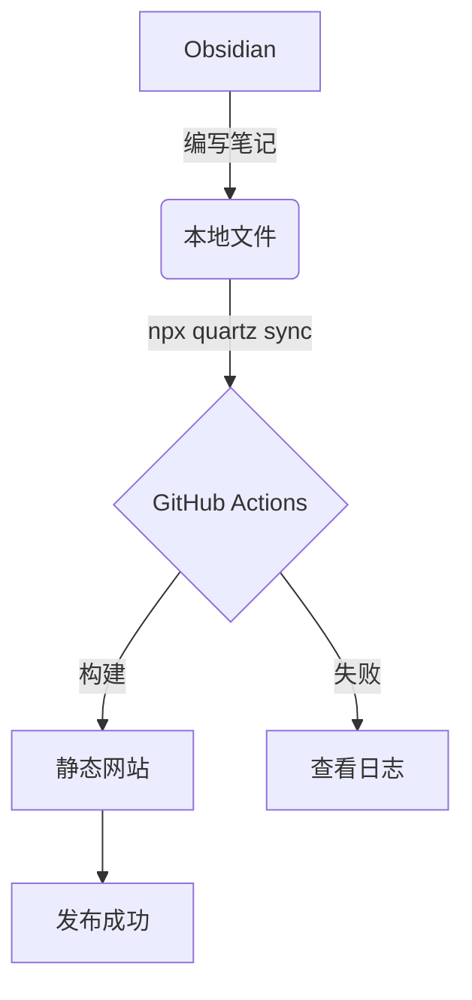

## 1. 文本格式与列表

这是普通文本。这是 **加粗文本**，这是 *斜体文本*，这是 ==高亮文本==（Obsidian 语法）。

> [!quote] 引用
> Quartz 的设计理念是让你的数字花园像水晶一样生长。

**我的待办清单：**
- [x] 安装 Quartz
- [x] 部署到 GitHub Pages
- [ ] 写第一篇真正的博客

---

## 2. 代码块高亮

Quartz 使用 Shiki 进行语法高亮，效果非常棒。

```python
def hello_world():
    print("Hello, Quartz!")
  
# 这是一个测试函数
if __name__ == "__main__":
    hello_world()


或者 TypeScript:

```typescript
interface User {
  id: number;
  name: string;
}

const user: User = {
  id: 1,
  name: "Quartz User",
};
```

---

## 3. Callouts (警告与提示)

Quartz 完美支持 Obsidian 的 Callout 语法：

> [!info] 提示信息
> 这是一个信息提示块。

> [!warning] 注意
> 这是一个警告块，通常用来提示读者注意某些坑。

> [!tip] 技巧
> 你可以在 `quartz.layout.ts` 中自定义这些颜色。

---

## 4. 图片测试

请确保你已经设置了附件文件夹（例如 `attachments`）。你可以随便找一张图片，重命名为 `test-image.png` 并拖入 Obsidian，它应该会显示在下面：

![[test_aliya.jpg]]

*（如果图片未显示，请确认图片文件是否放在了你设置的附件子文件夹中）*

---

## 5. 数学公式 (LaTeX)

Quartz 内置了 Latex 支持：

行内公式：$E = mc^2$

独立公式块：
$$
f(x) = \int_{-\infty}^\infty \hat f(\xi)\,e^{2\pi i \xi x} \,d\xi
$$

---

## 6. 表格

| 功能    | 状态  |     备注 |
| :---- | :-: | -----: |
| 静态网页  |  ✅  |   速度极快 |
| 移动端适配 |  ✅  |  响应式设计 |
| 双向链接  |  ✅  | 知识图谱核心 |

---

## 7. Mermaid 图表

如果你需要画流程图，Quartz 也能直接渲染：



---

## 8. 双向链接测试

这是 [[index|回到主页]] 的链接（指向你的 index.md）。
```

### 📝 后续操作：

1.  **处理图片**：找一张随便什么图片，改名为 `test-image.png`，直接拖进这篇笔记里（Obsidian 会自动把它放到 `attachments` 文件夹）。
2.  **发布**：点击你刚才在侧边栏添加的 **上传按钮**。
3.  **查看**：等待 2 分钟后，访问你的博客，检查上述所有元素是否渲染正常。

如果这篇笔记能完美显示，你的博客系统就彻底毕业了！
```


See the [documentation](https://quartz.jzhao.xyz) for how to get started.